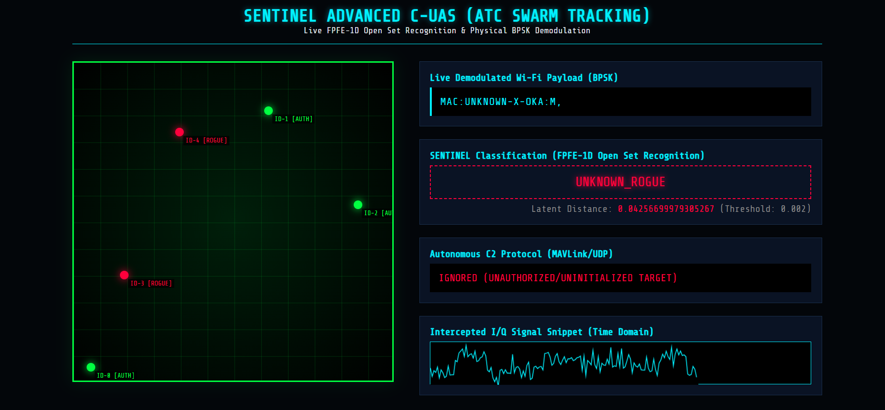

# SENTINEL Advanced C-UAS (ATC Swarm Tracking)

An end-to-end Counter-Unmanned Aerial Systems (C-UAS) defense platform simulating real-time drone tracking, physical-layer RF signal demodulation, and AI-driven Open Set Recognition (OSR) to detect and mitigate rogue drones autonomously.



## Overview

SENTINEL operates as a Command and Control (C2) server orchestrating a simulated airspace. The system relies on intercepting simulated physical RF (Radio Frequency) bursts from drones and processing them through a Deep Learning pipeline to distinguish between known, authorized drones and unknown, rogue drones.

### Key Features
- **Real-Time ATC Radar Dashboard:** A live, dynamic frontend tracking drone coordinates in a 1000x1000 grid using WebSockets.
- **Physical-Layer Demodulation:** Simulates raw Baseband I/Q (In-phase and Quadrature) signal interception, applying Carrier Frequency Offset (CFO) correction and BPSK (Binary Phase Shift Keying) demodulation to decode Wi-Fi payloads.
- **FPFE-1D Open Set Recognition (OSR):** Uses a custom 1D Fingerprint Pyramid Feature Extractor (FPFE-1D) trained with both CrossEntropy and **Center Loss**. This compacts authorized drone signals tightly in the latent space, allowing the system to flag any RF signature falling outside a rigorous `0.002` cosine distance threshold as an `UNKNOWN_ROGUE`.
- **Autonomous MAVLink Mitigation:** When an authorized drone is recognized, the system issues an automated `MAV_CMD_NAV_LAND` UDP packet command via the MAVLink protocol.

## Architecture

1. **Drone Simulator (`multi_drone_sim.py`)**: Simulates a swarm of drones flying in randomized trajectories. Periodically generates physical I/Q signal bursts containing a MAC address payload with added Gaussian noise and frequency offset, and streams them over WebSockets.
2. **C2 Server (`src/c2_server.py`)**: The FastAPI backend orchestrator. It receives raw radar sweeps, runs BPSK demodulation, and feeds the raw I/Q tensors into the PyTorch SENTINEL AI model.
3. **SENTINEL AI (`src/signal_processing/sentinel_model.py`)**: The FPFE-1D neural network. It extracts a 256-D embedding from the signal and calculates its distance to known authorized drone centroids.
4. **Frontend Dashboard (`frontend/index.html`)**: A sleek, dark-mode ATC interface serving live telemetry, mitigation actions, and a real-time graph of the intercepted time-domain I/Q signal snippet.

## Installation

Ensure you have Python 3.9+ installed, preferably in a virtual environment (e.g., Anaconda `torch-gpu` environment).

1. Clone the repository.
2. Install the required dependencies:
   ```bash
   pip install -r requirements.txt
   ```
   *(Requires: `fastapi`, `uvicorn`, `torch`, `numpy`, `scipy`, `websockets`)*

## How to Run

Running the full simulation requires starting both the C2 Server and the Drone Simulator.

1. **Start the C2 Server**:
   Open a terminal and run the FastAPI server:
   ```bash
   python -m uvicorn src.c2_server:app --host 127.0.0.1 --port 8000
   ```

2. **Open the Dashboard**:
   In your browser, navigate to:
   ```text
   http://127.0.0.1:8000/
   ```

3. **Spawn the Drone Swarm**:
   Open a second terminal window and start the simulator:
   ```bash
   python simulator/multi_drone_sim.py
   ```

Watch the dashboard populate with live drones. When a drone transmits an RF burst, the AI pipeline will classify it and color-code it in real-time (Green for Authorized, Red for Rogue) based on the latent cosine distance of its RF signature!

## Re-Training the Model
If you wish to re-train the FPFE-1D model and generate new OSR centroids:
```bash
python src/signal_processing/train_sentinel.py
```
This will output `sentinel_weights.pth` and `osr_centroids.npy` to the root directory, optimizing the feature embeddings using Center Loss to ensure extreme clustering density for authorized RF signatures.
